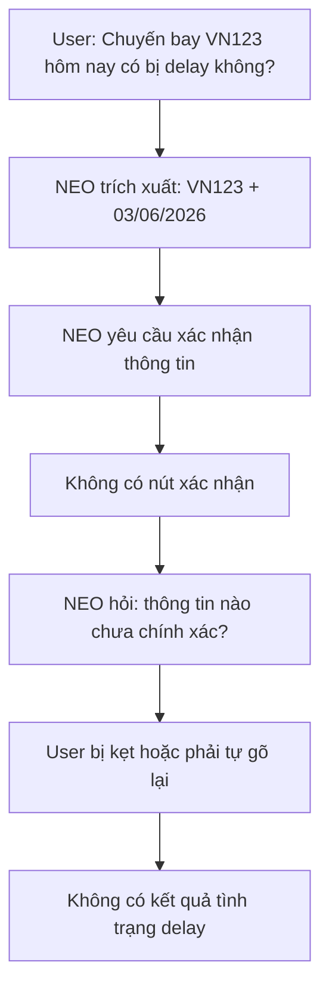
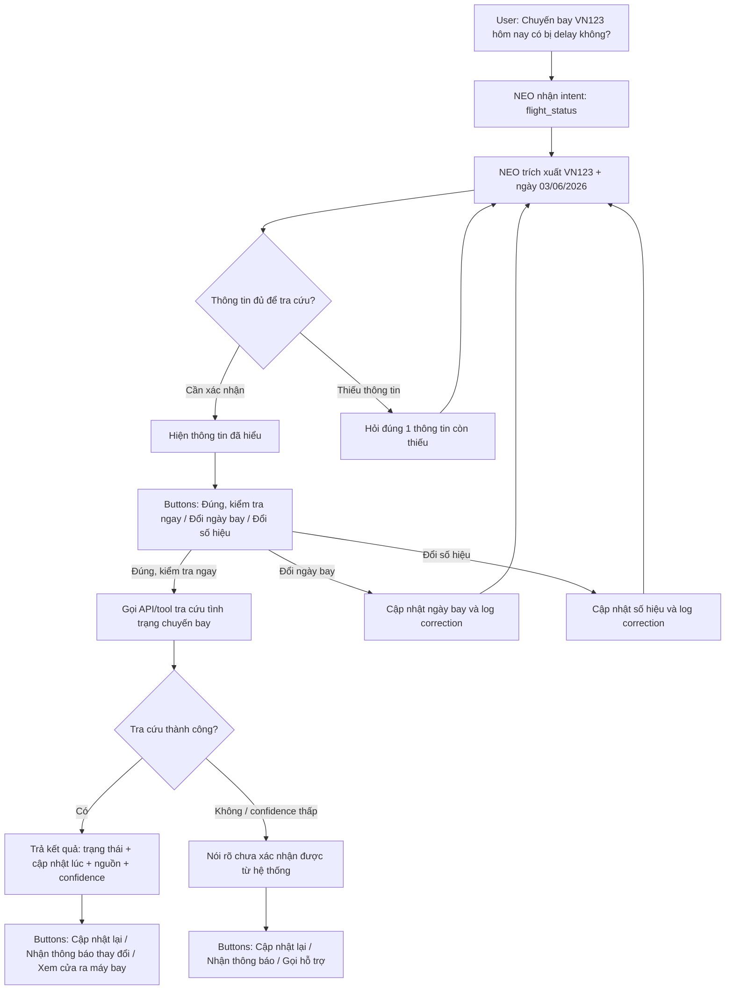

# Workshop - Mổ App AI Thật

**Thời gian:** 35-45 phút  
**Hình thức:** cá nhân trước, chia sẻ theo nhóm sau  
**Output:** finding note + sketch `as-is / to-be`

Mục tiêu không phải chấm "UI đẹp hay xấu". Mục tiêu là dùng sản phẩm thật như một bài needfinding: tìm chỗ product gãy trong workflow thật, rồi viết finding đó thành quyết định product.

## 1. Chọn một sản phẩm để dùng thử

| Sản phẩm | AI feature | Cách truy cập |
|---|---|---|
| MoMo - Moni | Trợ thủ tài chính, phân tích chi tiêu, chatbot | App MoMo |
| Vietnam Airlines - NEO | Chatbot hỗ trợ vé, hành lý, khiếu nại | Website/Zalo VNA |
| V-App - V-AI | Trợ lý voice/text, gợi ý theo ngữ cảnh | App V-App |

**Sản phẩm chọn:** Vietnam Airlines - NEO

## 2. Dùng thử: promise vs reality

### Promise

Từ góc nhìn người dùng, NEO tạo kỳ vọng là chỉ cần hỏi bằng ngôn ngữ tự nhiên thì sẽ nhận được câu trả lời nhanh về chuyến bay. Người dùng không nghĩ mình đang "điền form"; họ kỳ vọng bot hiểu câu hỏi "hôm nay có bị delay không?" và trả lời thẳng vào điều họ cần biết.

### User nào được hứa sẽ được giúp

- Một hành khách sắp ra sân bay và đang lo chuyến bay có bị trễ không.
- Người đã biết số hiệu chuyến bay nhưng không muốn tự tìm nhiều màn hình trong website/app.
- Người cần câu trả lời nhanh để quyết định: đi ngay, chờ thêm, gọi người nhà, đổi kế hoạch di chuyển.

### Kỳ vọng AI làm được task nào

Prompt/input đã thử:

```text
Chuyến bay VN123 hôm nay có bị delay không?
```

Kỳ vọng của người dùng:

- Bot hiểu mình đang hỏi tình trạng chậm trễ của chuyến bay.
- Nếu bot đã hiểu `VN123` và "hôm nay", bot nên cho xác nhận thật nhanh.
- Người dùng muốn bấm **Đúng, kiểm tra ngay**, không muốn phải gõ lại thông tin.
- Sau khi xác nhận, người dùng muốn biết ngay: **có delay không**, cập nhật lúc nào, và nếu có thay đổi thì cần làm gì tiếp.

### Reality / observation

NEO đã nhận ra số hiệu chuyến bay `VN123` và ngày khởi hành `03/06/2026`, nhưng flow bị đứt ở bước xác nhận:

```text
Quý khách vui lòng xác nhận lại thông tin chuyến bay:

* Số hiệu chuyến bay: VN123
* Ngày khởi hành: 03/06/2026

Để tôi kiểm tra tình trạng chậm trễ của chuyến bay này, xin vui lòng xác nhận đây là thông tin chính xác.
```

Sau đó bot hỏi tiếp:

```text
Quý khách vui lòng cho biết thông tin nào chưa chính xác để tôi cập nhật lại giúp quý khách nhé.
```

Điểm gãy theo cảm nhận người dùng: bot đã hiểu gần đúng nhưng lại không cho cách đi tiếp. Câu "vui lòng xác nhận" khiến người dùng nghĩ sẽ có nút xác nhận, nhưng màn hình không có nút nào. Câu tiếp theo "thông tin nào chưa chính xác" còn làm người dùng hơi bối rối, vì họ chưa nói thông tin sai; họ chỉ muốn bot kiểm tra delay.

Evidence: screenshot trong thư mục `01-invidual-workshop/image.png`.

## 3. Vẽ 4 paths

| Path | As-is | To-be |
|---|---|---|
| Happy | Người dùng hỏi delay. Bot nhận ra VN123 và ngày bay, nhưng chưa trả lời câu hỏi chính. | Người dùng bấm **Đúng, kiểm tra ngay** và nhận câu trả lời rõ: có delay hay không, cập nhật lúc nào. |
| Low-confidence | Bot hỏi lại chung chung, làm người dùng không biết bot đang thiếu gì. | Bot nói rõ: "Mình hiểu là VN123 hôm nay. Bạn xác nhận giúp mình nhé." Kèm nút xác nhận/sửa. |
| Failure | Người dùng bị kẹt vì không có hành động tiếp theo. Trải nghiệm giống như bot hỏi nhưng không nghe câu trả lời. | Nếu không tra cứu được, bot nói rõ "mình chưa xác nhận được từ hệ thống" và đưa lựa chọn **Cập nhật lại** hoặc **Gọi hỗ trợ**. |
| Correction | Nếu ngày bay hoặc số hiệu sai, người dùng phải tự gõ lại và không biết bot có cập nhật chưa. | Người dùng bấm **Đổi ngày bay** hoặc **Đổi số hiệu**, bot cập nhật lại ngay và xác nhận trước khi tra cứu. |

## 4. Viết finding thành quyết định

### Finding

```text
Khi user hỏi "Chuyến bay VN123 hôm nay có bị delay không?",
AI/product nhận ra được số hiệu chuyến bay và ngày bay nhưng không đưa cách xác nhận nhanh,
hậu quả là user bị kẹt ở đúng lúc họ đang cần câu trả lời gấp để quyết định có ra sân bay hay không.
Lỗi thuộc layer Intent + UX Recovery + Data-tool handoff.
Nên sửa bằng low-confidence path nhìn từ hành vi người dùng: bot xác nhận lại thông tin bằng button, cho sửa từng trường, rồi trả kết quả chuyến bay ngay sau khi user confirm.
```

### Product decision

Ưu tiên sửa path `flight_status confirmation` trước khi mở rộng các tính năng chatbot khác. Lý do: đây là khoảnh khắc người dùng đang lo và cần quyết định nhanh. Nếu bot bắt họ gõ lại hoặc tự đoán cách tiếp tục, niềm tin vào chatbot giảm ngay cả khi bot đã hiểu đúng một phần câu hỏi.

Requirement để đưa vào SPEC:

- Thêm state `awaiting_flight_confirmation` sau khi NEO trích xuất được số hiệu chuyến bay và ngày bay.
- Hiện 3 action buttons: **Đúng, kiểm tra ngay**, **Đổi ngày bay**, **Đổi số hiệu chuyến bay**.
- Khi user confirm, gọi tool/API tra cứu tình trạng chuyến bay.
- Kết quả phải có: trạng thái, thời điểm cập nhật, nguồn dữ liệu, mức độ chắc chắn.
- Nếu không tra cứu được hoặc confidence thấp, hiện fallback: **Cập nhật lại**, **Nhận thông báo thay đổi**, **Gọi hỗ trợ**.
- Mỗi correction của user phải cập nhật conversation state và ghi vào correction log.

## 5. Sketch as-is / to-be

### As-is



### To-be



## 6. Tự kiểm trước khi nộp

- [x] Có ít nhất 1 screenshot hoặc observation cụ thể.
- [x] Có đủ 4 paths hoặc nói rõ path nào chưa có trong product.
- [x] Finding được viết thành product decision, không chỉ là nhận xét.
- [x] Sketch có as-is và to-be.
- [x] Có một câu nói rõ finding này sẽ đổi gì trong SPEC.
